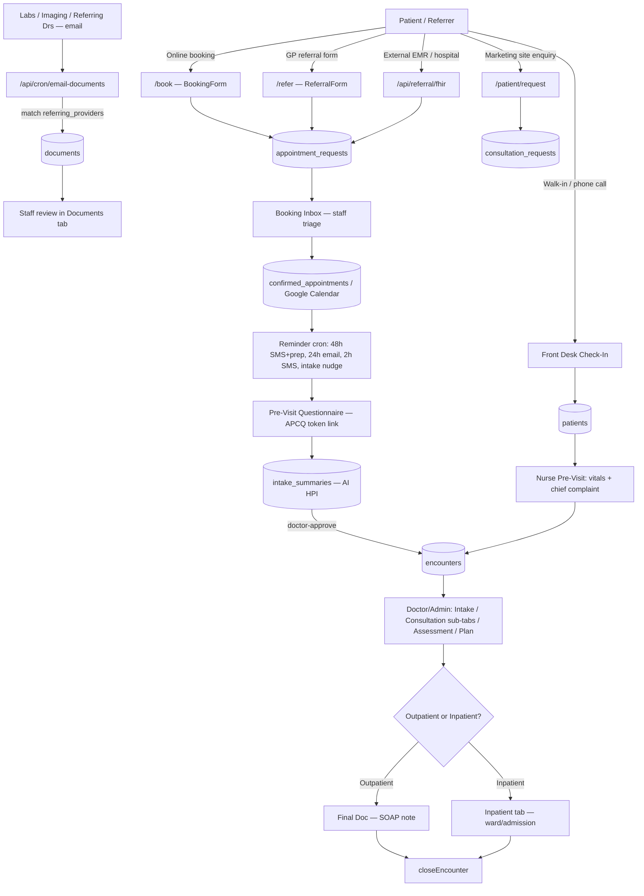
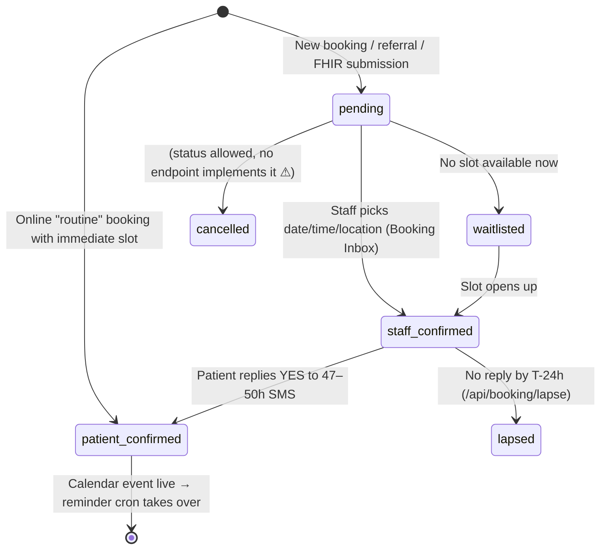
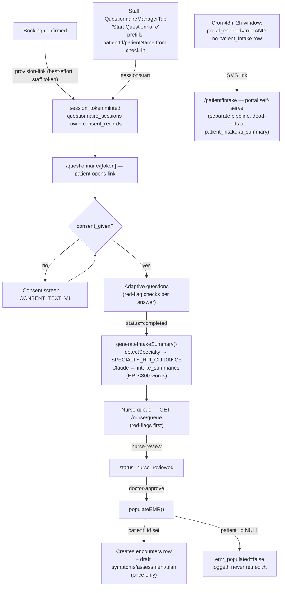
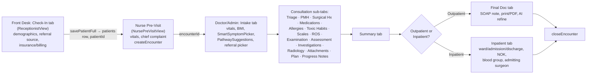
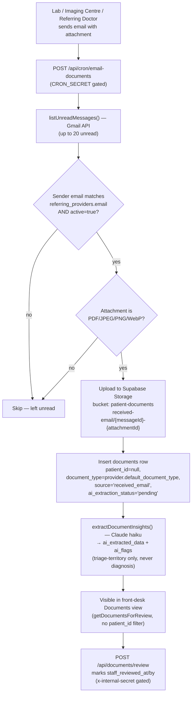

# Amise MedFlow EMR — End-to-End Process Manual & Flowchart Synopsis

A reference manual for how a patient/referral moves through the whole system —
from the first point of contact (online booking, GP referral, FHIR feed,
portal enquiry, or walk-in) through pre-visit questionnaires, front-desk
check-in, the clinical EMR workflow, document intake, and the automated
reminder/escalation jobs that run alongside it.

This document is a **synopsis** generated from the current codebase
(2026-06-13). Where the code has gaps, inconsistencies, or items that look
unfinished, they're called out under **⚠ Gaps / Pending** in each section and
collected in the final checklist.

---

## 1. System Overview

---

## 2. Actors & Roles

`user_profiles.role` ∈ `front_desk | nurse | doctor | admin` (rank 0–3 in
`lib/roles.ts`). New Supabase Auth users default to `front_desk`.

| Role | Landing view | Sees |
|---|---|---|
| **front_desk** | `ReceptionistView` (Check-In / Booking Inbox / Questionnaire) | Dashboard, Patients, Intake, Consultation (read), Scheduling, Billing, Referring Providers |
| **nurse** | `NursePreVisitView` (vitals + chief complaint) | + Booking Inbox, Trauma, Disease Dict., Questionnaire (`NurseAPCQTab`), Examination/Investigations/Radiology/Attachments |
| **doctor** | Main dashboard (`Home.tsx`) | + Procedures, Analytics, Assessment/Plan, Portal Intake, Summary, full Consultation sub-tabs |
| **admin** | Main dashboard | Everything, incl. Settings, Booking Inbox, Portal Intake, Referring Providers CRUD |

---

## 3. Entry Points

### 3.1 Online Booking — `/book` (BookingForm.tsx)

1. **Track**: `routine` or `referral` (a third `urgent` track exists in
   `TRACK_CONFIG` but has no UI — only reachable via referral/FHIR paths).
2. **Appointment type**: grouped by Consultations / Endoscopy & Procedures /
   Specialist Clinics / Surgery & Post-Op — each maps to a default site
   (Rodney Bay / Castries / Tapion / remote).
3. **Patient details**: name, WhatsApp/mobile (required), email (optional),
   DOB, reason. Referral track also requires referring doctor + practice.
4. **Slot picker**: `GET /api/booking/slots` reads the relevant Google
   Calendar for free/busy and proposes slots per `SLOT_RULES`
   (routine: 21-day lookahead / 3 slots; referral: 7-day / 5 slots).
5. **Submit → `POST /api/booking/create`**:
   - Phone normalized to E.164.
   - `routine` + slot selected → calendar event created immediately,
     `appointment_requests.status = 'patient_confirmed'`.
   - Otherwise → `status = 'pending'`, `preferred_slot` stored.
   - Best-effort call to api-server `/api/questionnaire/provision-link`
     (mints an APCQ session/token, see §5).
   - SMS/WhatsApp + email confirmation sent to patient; staff notified via
     `NURSE_ALERT_WHATSAPP` for non-routine tracks.

**Alternatives on this page**: WhatsApp call links (Tapion, Rodney Bay); if
`routine` has zero slots, a "Call Tapion Hospital" tel: link replaces submit.

### 3.2 GP Referral — `/refer` (ReferralForm.tsx → `/api/referral/create`)

GP-facing form: referrer name/practice/phone/email, patient details,
appointment type, priority (`routine`/`priority`/`urgent`), clinical reason.
Generates `referralId = REF-<base36 timestamp>`. `priority='urgent'` →
`track='urgent'`/`triage_acuity='urgent'`; else `track='referral'`. Inserts
`appointment_requests` (`status='pending'`), logs audit `gp_referral_received`,
notifies staff (WhatsApp) and sends an unconfirmed patient email.

### 3.3 FHIR Referral — `/api/referral/fhir`

FHIR R4 endpoint for external hospital/EMR systems (e.g. Tapion). Accepts a
`Bundle` or `ServiceRequest` resource. Rejects `revoked`/`entered-in-error`
statuses; maps FHIR `priority` (`stat`/`asap`→urgent, `urgent`→priority, else
routine); extracts contained `Patient`/`Practitioner`; generates
`referralId = FHIR-<base36 timestamp>`; inserts `appointment_requests`
(`status='pending'`), logs `fhir_referral_received`, returns a FHIR
`OperationOutcome`.

### 3.4 Patient Portal Enquiry — `/patient/request`

A lightweight 3-question routing wizard on the public/marketing site, **not**
part of the `appointment_requests` pipeline. Submits to
`POST /api/patient/request-consult` → inserts into a separate
**`consultation_requests`** table (`status: new | contacted | registered`).
Surfaced in the dashboard as the "Public Enquiries" view, distinct from
"Booking Requests".

### 3.5 Walk-in / Phone — Front Desk Check-In

See §6.1 — staff enter the patient directly into `patients` via
`ReceptionistView`.

### ⚠ Gaps / Pending — Entry Points
- `urgent` booking track has no UI in BookingForm (referral/FHIR only).
- `appointment_requests_status_check` allows `cancelled`, but **no endpoint
  sets it** — cancellation is unimplemented for this table.
- `ercp_workup` is mapped to `rodney_bay` in `SLOT_RULES` but `tapion` in
  `APPOINTMENT_TYPES` — inconsistent site routing.
- `confirmed_appointments` and `pending_bookings` tables (used heavily by
  `cron.ts`) were not found in `supabase-schema.sql` — likely defined in a
  migration not yet reconciled into the main schema doc.
- `provisionQuestionnaireLink()` failures are silently swallowed — a booking
  can succeed with no APCQ link ever sent.
- Env vars `STAFF_NOTIFY_PHONE`, `STAFF_NOTIFY_EMAIL`, `NURSE_ALERT_WHATSAPP`,
  `PRACTICE_PHONE` are used but not documented in CLAUDE.md's env table.

---

## 4. Booking Lifecycle — `appointment_requests` State Machine

| Endpoint | File | Effect |
|---|---|---|
| `POST /api/booking/request` | `routes/booking.ts` | Create `pending` row |
| `POST /api/booking/staff-confirm/:id` | `routes/booking.ts` | `pending` → `staff_confirmed`, sets slot/location |
| `POST /api/booking/waitlist/:id` | `routes/booking.ts` | `pending` → `waitlisted` |
| `POST /api/booking/patient-confirm/:id` | `routes/booking.ts` | `staff_confirmed` → `patient_confirmed`, creates Calendar event |
| `POST /api/booking/lapse` | `routes/booking.ts` | `staff_confirmed` → `lapsed` if unconfirmed near slot time (cron-secret gated) |
| `GET /api/booking/requests` | `routes/booking.ts` | List for Booking Inbox tab |

**Multi-site routing**: Rodney Bay (`new_consult`, `breast`, `diabetic_foot`,
`pre_op`), Castries (`follow_up`, `post_op`), Tapion/ERCP (`ogd`,
`colonoscopy`, `flexi_sig`, `ercp_workup`), Remote (`telephone`).

**Urgent "squeeze slot"**: `findUrgentSlot()` first tries normal 48h-window
slots, then inserts a slot after the day's last booking (≤19:00) or a
pre-clinic 07:30 slot — labeled "(priority squeeze)" / "(early priority)" —
staff still approve manually.

---

## 5. Pre-Visit Questionnaire (APCQ) & Patient Portal

> **Two parallel intake systems exist** — they do not share data:
> 1. **APCQ** (`questionnaire_sessions` / `questionnaire_responses` /
>    `intake_summaries`) — anonymous, token-based, adaptive branching engine.
> 2. **Patient-portal self-serve intake** (`patient_intake`) — requires a
>    portal account, separate "choose-your-own-adventure" form and its own
>    Claude-generated `ai_summary` with **no review/EMR-population path found**.

### Token Points

| Token | Issued by | Checked by | Notes |
|---|---|---|---|
| `session_token` (32-hex) | `session/start` or `provision-link` | `GET session/:token`, `POST .../answer`, `.../summary`, `nurse-review`, `doctor-approve`, `send-sms` | Sole anonymous credential; URL path segment |
| `expires_at` (default 7 days) | `supabase-questionnaire-token-expiry-migration.sql` | `.../answer`, `GET session/:token` → 410 if expired | **Not surfaced pre-emptively** to the patient UI |
| `app.session_token` (Postgres RLS setting) | `supabase-apcq-migration.sql` | RLS policies on `questionnaire_sessions`/`responses` | Defense-in-depth alongside app-level token check |
| Staff JWT (`requireStaffAuth`) | Supabase Auth | `provision-link`, `nurse/queue`, `.../summary`, `nurse-review`, `doctor-approve` | |
| Portal auth (separate) | `patients.auth_user_id` / SMS-OTP | `/api/patient/*` routes | Independent of APCQ tokens |

### ⚠ Gaps / Pending — APCQ
- `populateEMR` **requires `patient_id`**; if a session has none and was
  never linked, `doctor-approve` logs a caught error,
  `emr_populated=false` **permanently**, with no retry/alert.
- `draftClinicalRecordsFromIntake` runs only once (`!alreadyPopulated`) — a
  re-approval after new responses won't add new draft symptom/assessment/plan
  rows.
- The SMS intake-reminder cron only targets `portal_enabled` patients with no
  `patient_intake` row — it's unaware of in-progress/completed APCQ sessions,
  so a patient could get a redundant nudge after already completing an APCQ.
- `provision-link` hardcodes `mode='screening'` and
  `delivery_method='whatsapp_link'` regardless of actual channel.
- No UI exists to **link an orphaned/anonymous APCQ session to a patient
  after the fact** — only set at creation time.
- The portal `patient_intake.ai_summary` pipeline appears to dead-end with no
  staff review surface or EMR population (separate from APCQ's).

---

## 6. Front-Desk Check-In → Clinical EMR Workflow

### 6.1 Check-In (`ReceptionistView.tsx`)

Collects: name, DOB/age/sex, phone, community/address (autocomplete via
`SL_COMMUNITIES` → auto-fills `quarter`), **referral source** (`referredBy` —
now a `<datalist>` sourced from `/api/admin/referring-providers`, filtered to
`provider_type='referring_doctor' && active`), insurance provider, policy
number, NHI number, pre-auth status.

`savePatientFull()` → inserts into `patients`; sets `preVisitStatus =
'registered'`; stores `patient.id` as `patientId` in `AppContext`. If
Supabase isn't configured, still flips to "registered" with a local-only
success message.

### 6.2 Nurse Pre-Visit (`NursePreVisitView.tsx`)

Vitals (SBP/DBP/HR/Temp/RR/SpO₂/glucose via `WheelPicker`), chief complaint
(fixed list), `createEncounter` + `saveVitals`/`saveSymptoms`/
`saveAllergyFreeText`. Sets `preVisitStatus = 'vitals_done'`.

### 6.3 Doctor/Admin Dashboard (`Home.tsx`)

Header banner gives **adaptive routing hints** from `getAdaptivePath()` based
on `preVisitStatus` + the live `adaptiveTriage()` result. Tabs:

- **Intake** — demographics, 7 vitals (red-flag styled), BMI, symptom picker,
  pathway suggestions, free-text, referral picker (merged `referring_providers`
  + static `SL_DOCTORS`), inpatient admission block (when
  `encounterMode==='inpatient'`).
- **Consultation** — Triage, PMH, Surgical Hx, Medications, Allergies, Toxic
  Habits, Scales, ROS, Examination (nurse+), Assessment (doctor+),
  Investigations (nurse+), Radiology (nurse+), Attachments (nurse+), Plan
  (doctor+), Progress Notes, Monitoring.
- **Procedures** (doctor/admin only), **Analytics** (doctor/admin).
- **Summary** → `SummaryTab.tsx`.
- **Final Doc / Inpatient** — printable SOAP note (letterhead, patient strip,
  signature block, print/PDF export, "AI refine") or, in inpatient mode, the
  `InpatientTab`. Finalizing calls `closeEncounter(encounterId)`.
- **Billing** (front_desk/admin) — Billing + Documents sub-tabs.

**Inpatient toggle**: header pill switches `currentSite='tapion'` and
`topSection='finaldoc'` → renders `InpatientTab` instead of `FinalDocTab`.

### 6.4 Shared Session State (`AppContext.tsx`)

One React context holds the entire in-progress encounter: identity,
insurance, vitals, symptoms/PMH/meds/allergies, exam findings,
investigations/codes, BMI inputs, assessment/plan/procedures/billing,
documents, attachments, radiology requests, final document, progress notes,
inpatient fields, and the live `triageResult`. Debounced to `localStorage`
(`amise-enc-v1`) and autosaved to Supabase (assessment/plan/medications every
2s, allergies/exam every 3s) once `patientId`/`encounterId` exist.
`clearPatient()` resets for the next patient.

### 6.5 Triage Engine (`lib/triage-engine/src/adaptive-triage.ts`)

`adaptiveTriage(input)` runs regex red-flag scans (ERCP, breast, post-op,
hernia, endoscopy, diabetic foot, GI bleed, chest pain) plus vital-sign red
flags, accumulating a `score`:

| Score | Acuity | Recommended action |
|---|---|---|
| ≥45 or urgent red flag | `urgent` | `emergency_now` |
| ≥28 or priority red flag | `priority` | `same_day_call` |
| ≥14 or review red flag | `review` | `priority_24_48h` |
| else | `routine` | `routine_booking` |

Also outputs `appointmentType`, `activePathways`, `questionsToAsk`,
`safetyMessage`, `frontDeskScript`, `suggestedBlocks`, `missingCriticalFields`
— feeds the header acuity badge, Intake vital styling, adaptive routing, and
the Final Doc record.

### ⚠ Gaps / Pending — Check-in / EMR
- `DocumentsTab.tsx` is largely a stub (file upload "future release"; only a
  free-text discharge-letter textarea works; PACS/RIS/LIS linking is a
  placeholder).
- **Inconsistent referral picker UX**: `ReceptionistView` shows a plain
  `<datalist>` (name only); `IntakeTab` shows a richer dropdown with
  specialty/institution — same `referredBy` field, two different pickers.
- `savePatientFull` doesn't persist `quarter` to `patients`.
- `StubPanel` placeholders remain for other "future" sections beyond Documents.
- `FinalDocTab`'s "AI refine" (`callAiRefine`) appears to use a **frontend
  `VITE_ANTHROPIC_API_KEY`** — worth checking against the `MODE`-gate /
  backend-proxy pattern used everywhere else.
- `InpatientTab` discharge/close-encounter parity with `FinalDocTab` not
  fully verified.

---

## 7. Documents Pipeline & Email Intake

**`referring_providers` directory — dual role**:
1. **Email matching** (labs/radiology/referring doctors) → drives auto-filing
   and `document_type` assignment.
2. **"Referred by" dropdown** in `ReceptionistView` and `IntakeTab` (filtered
   to `provider_type='referring_doctor' && active`) — seeded with ~42 doctors
   via `supabase-referring-doctors-seed-migration.sql`.

CRUD: `GET/POST/PATCH/DELETE /api/admin/referring-providers[/:id]`
(`email-intake.ts`), staff-auth gated, admin UI = `ReferringProvidersTab.tsx`.

### ⚠ Gaps / Pending — Documents
- No matched attachment → message stays unread; **no document explicitly
  linked to a `patient_id`** for emailed documents — only a generic
  "reviewed" flag. A dedicated "link this document to patient X" action seems
  missing.
- The dashboard's own `DocumentsTab.tsx` is a stub — the real review surface
  is in `artifacts/front-desk`'s dashboard.

---

## 8. Automated / Cron Jobs

| Endpoint | File | Trigger window | Purpose | Channels |
|---|---|---|---|---|
| `POST /api/cron/reminders` | `cron.ts:22` | 48h & 2h before `confirmed_appointments.start_time` | 48h SMS + prep instructions, 24h confirmation email, 2h SMS, **intake-questionnaire SMS nudge** (48h–2h window, portal patients w/o `patient_intake`) | SMS (Twilio), Email (Gmail) |
| `POST /api/cron/daily-summary` | `cron.ts:137` | Daily | Emails Dr Kabiye: today's appointments, escalations, pending replies | Email → `DOCTOR_NOTIFY_EMAIL` |
| `POST /api/cron/booking-reminders` | `cron.ts:207` | `staff_confirmed` requests 47–50h out | "Reply YES to confirm" SMS + prep | SMS |
| `POST /api/cron/staff-escalation` | `cron.ts:261` | `pending` requests >2h (staff re-notify), >4h (doctor escalation) | Unactioned booking alerts | SMS + Email |
| `POST /api/cron/email-documents` | `email-intake.ts:25` | Polls Gmail | Auto-file lab/imaging/referral attachments into `documents` | Gmail read, Claude extraction |

All five are gated by `requireCronSecret()` (`x-cron-secret` header or
`?secret=`), **but `CRON_SECRET` is not set in `render.yaml`** — the gate is
a no-op if the env var is unset (`if (!secret) return true`).

### ⚠ Gaps / Pending — Automation
- **No scheduler in this repo invokes any of the five `/api/cron/*`
  endpoints.** The only `schedule:`-triggered GitHub Action is
  `keep-api-warm.yml` (`*/10 * * * *`, pings `/api/healthz` only). These jobs
  are either triggered by an external scheduler not present in the repo
  (cron-job.org, UptimeRobot, Render paid cron) or are currently dormant.
- `CRON_SECRET` unset on Render → these endpoints are effectively
  **unauthenticated** in production if they are reachable.
- `.github/workflows/run-migrations.yml` only runs 5 of the ~18 migrations
  (see §10) — several migrations the live code already depends on
  (`referring_providers`, the doctor seed, clinical-photo doc type,
  service-role grants) are **not** in that workflow and rely on manual
  execution in the Supabase SQL Editor.

---

## 9. Auth, Operating Modes & Safety Layer

### 9.1 Token Types

| Token | Issued | Checked | Used for |
|---|---|---|---|
| Supabase staff JWT | `signInWithPassword()` | `requireStaffAuth()` (`Authorization: Bearer`) | Dashboard staff actions, admin CRUD |
| `x-staff-token` / `CRON_SECRET` | Shared env secret | `requireStaffAuth()`, `requireCronSecret()` | Internal service-to-service + cron |
| `session_token` | `questionnaire.ts` | APCQ routes (see §5) | Anonymous patient questionnaire access |
| Portal auth (`auth_user_id`, SMS-OTP) | `portal.ts` | `/api/patient/*` | Patient portal self-service |

### 9.2 `MODE` Gate (`dry_run` / `supervised` / `auto`)

- **`dry_run`** (default): no outbound action — `sendOrDraft`/`sendSms`
  return `{action:'skipped'}`.
- **`supervised`**: Gmail messages created as **drafts** for human review;
  SMS still effectively dry unless `SMS_PROVIDER` is also non-dry.
- **`auto`**: Gmail sends directly; SMS sends via configured provider.
- `intake.ts` **always forces `supervised`** for low-confidence/out-of-scope
  drafts, regardless of global `MODE`.
- Every send/draft/skip is recorded via `audit()`, stamped with the active
  `MODE`.

### 9.3 Safety Layer — `FORBIDDEN_PATTERNS`

`checkForbiddenContent(text)` (in `lib/triage-engine/src/rules.ts`) blocks
Claude-drafted replies containing:
- Currency/fees (`$\d`, `EC$/XCD/USD \d`)
- Drug dosage instructions ("take/increase/decrease/stop N mg")
- Lab/imaging result disclosure ("the result is/shows...")
- Diagnoses/cancer language ("you have/may have cancer...", "I diagnose...")

If unsafe, `draftReply()` flags it; `intake.ts` aborts the send, logs
`audit({action:'skip', entityType:'gmail_message', payload:{violations}})` —
**the `audit_log` table is the de facto quarantine** (no separate quarantine
table); the source email stays unread in Gmail for human review.

---

## 10. Migration History (chronological / dependency order)

| # | File | Purpose | Run via workflow? |
|---|---|---|---|
| 1 | `supabase-schema.sql` | Base 12-table schema, roles, `auth_role()` | — (initial) |
| 2 | `supabase-clinical-records-migration.sql` | `clinical_notes`, `documents`, `billing_charges`, `imaging_orders`, `investigation_results` | ✅ run-migrations.yml |
| 3 | `supabase-emr-persistence-migration.sql` | Unique constraints for assessment/plan upserts | — |
| 4 | `supabase-patient-portal-migration.sql` | `patients.auth_user_id` ↔ `auth.users` | ✅ run-migrations.yml |
| 5 | `supabase-portal-self-service-migration.sql` | Patient-editable profile, `patient_intake`, storage policies | ✅ run-migrations.yml |
| 6 | `supabase-apcq-migration.sql` | APCQ module, `generate_session_token()` | ✅ run-migrations.yml |
| 7 | `supabase-ai-adaptive-intake-migration.sql` | `visit_type`/`complexity_score`/`ai_summary`, `consultation_requests` | — |
| 8 | `supabase-email-document-intake-migration.sql` | `referring_providers`, `documents.patient_id` nullable | ⚠ not in workflow |
| 9 | `supabase-document-ai-extraction-migration.sql` | AI extraction columns on `documents` | ✅ run-migrations.yml |
| 10 | `supabase-referring-doctors-seed-migration.sql` | Seeds ~42 referring doctors; `email` nullable | ⚠ not in workflow (manual — **just applied**) |
| 11 | `supabase-service-role-grants-fix-migration.sql` | Fixes missing `grant ... to service_role` (502 fix) | ⚠ not in workflow |
| 12 | `supabase-booking-source-migration.sql` | `source`/`whatsapp_from` on `appointment_requests` | — |
| 13 | `supabase-booking-notifications-migration.sql` | Ack/notify/escalation timestamps on `appointment_requests` | — |
| 14 | `supabase-intake-reminder-migration.sql` | `intake_reminder_sent` on `confirmed_appointments` | — |
| 15 | `supabase-booking-waitlist-migration.sql` | `waitlisted` status on `appointment_requests` | — |
| 16 | `supabase-questionnaire-token-expiry-migration.sql` | `expires_at` (7-day) on `questionnaire_sessions` | ✅ run-migrations.yml |
| 17 | `supabase-documents-clinical-photo-migration.sql` | `clinical_photo` document type | ⚠ not in workflow |
| 18 | `supabase-appointment-requests-email-optional-migration.sql` | `appointment_requests.patient_email` nullable | ⚠ not in workflow |

**⚠ Action**: confirm migrations marked "not in workflow" have actually been
applied to production — the live code (`referring_providers`,
`patient_email` nullable, `clinical_photo` doc type, service-role grants)
already depends on all of them.

---

## 11. Complete `/api/*` Route Map

| Prefix | File | Covers |
|---|---|---|
| `/api/healthz` | `health.ts` | Health check (kept warm by GitHub Action) |
| `/api/intake/run` | `intake.ts` | Gmail intake/classification + safety-checked auto-reply |
| `/api/triage/preview` | `triage-preview.ts` | Triage scoring preview |
| `/api/cron/*` | `cron.ts` | Reminders, daily summary, booking reminders, staff escalation |
| `/api/summary/generate` | `summary.ts` | AI summary generation |
| `/api/scheduling/*` | `scheduling.ts` | Slots, calendar sync, upcoming appointments |
| `/api/booking/*` | `booking.ts` | Booking request lifecycle (§4) |
| `/api/questionnaire/*` | `questionnaire.ts` | APCQ sessions, nurse queue, doctor approval (§5) |
| `/api/whatsapp/inbound` | `whatsapp.ts` | Inbound WhatsApp webhook |
| `/api/patient/*` | `portal.ts` | Portal registration, SMS-OTP, documents, consultation requests |
| `/api/investigations/extract-results` | `investigations.ts` | Lab/imaging result extraction |
| `/api/cron/email-documents`, `/api/admin/referring-providers*` | `email-intake.ts` | Document email intake + directory CRUD (§7) |

---

## 12. Consolidated Pending / To-Do Checklist

**Schema / migrations**
- [ ] Verify migrations #8, #10, #11, #17, #18 (table above) are applied in
  production Supabase — code already depends on all of them.
- [ ] Reconcile `confirmed_appointments` and `pending_bookings` table
  definitions into `supabase-schema.sql` (currently undocumented there).

**Automation / cron**
- [ ] Set `CRON_SECRET` in Render env vars (currently unset → cron endpoints
  unauthenticated).
- [ ] Wire an actual scheduler (Render cron job, cron-job.org, etc.) to call
  the five `/api/cron/*` endpoints — none currently fire automatically.

**Booking**
- [ ] Decide on/implement `cancelled` status handling for
  `appointment_requests` (allowed by constraint, no endpoint).
- [ ] Fix `ercp_workup` site-routing inconsistency (Rodney Bay vs Tapion).
- [ ] Add UI for the `urgent` booking track, or confirm referral/FHIR-only is
  intentional.

**Questionnaire / APCQ**
- [ ] Add a retry/alert path for `populateEMR` failures when `patient_id` is
  missing (currently silent, permanent `emr_populated=false`).
- [ ] Add a staff UI to link an orphaned/anonymous APCQ session to a patient
  after creation.
- [ ] Decide the fate of the portal `patient_intake.ai_summary` pipeline
  (currently no review/EMR path) — merge into APCQ or build its own review
  surface.
- [ ] Surface `expires_at` to the patient before the link goes dead.

**Documents**
- [ ] Build a "link document to patient" action for unmatched/emailed
  documents (currently only a reviewed/unreviewed flag).
- [ ] Build out `DocumentsTab.tsx` in the main dashboard (currently a stub;
  real review UI lives in `front-desk`).

**Clinical EMR**
- [ ] Unify the two "Referred by" pickers (`ReceptionistView` plain datalist
  vs `IntakeTab` rich dropdown) for consistent UX.
- [ ] Persist `quarter` from check-in into `patients`.
- [ ] Audit `FinalDocTab`'s "AI refine" — confirm it doesn't use a
  client-exposed Anthropic key outside the `MODE`-gated backend pattern.
- [ ] Confirm `InpatientTab` has discharge/`closeEncounter` parity with
  `FinalDocTab`.

**Referring doctors directory** (recently added)
- [x] Seed migration applied (~42 doctors, `provider_type='referring_doctor'`).
- [x] "Referred by" dropdowns wired in `ReceptionistView` and `IntakeTab`.
- [ ] New doctors/emails to be added incrementally via
  `ReferringProvidersTab` admin UI as the user requests them.

---

*Generated from a full-codebase pass on 2026-06-13. File:line references in
each section point to the implementation as of that date — re-run a similar
pass if major refactors land, since flow/state names may shift.*
